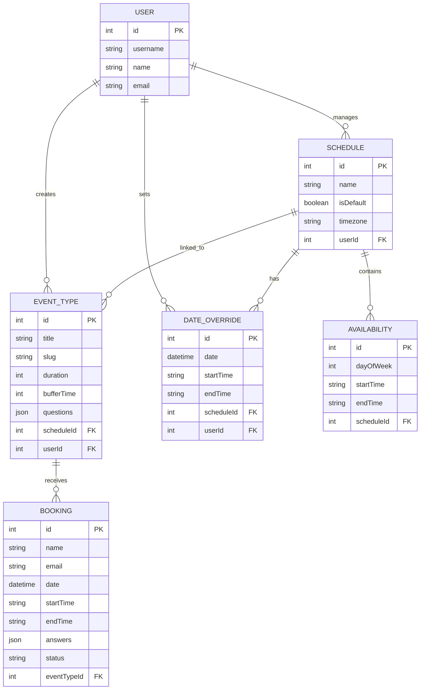

# Database Design: MeetFlow

This document outlines the database schema and relationships used in MeetFlow to provide a robust and scalable scheduling experience.

## 📊 Entity Relationship Diagram

## 🛠 Design Decisions

### 1. Multi-Schedule Architecture
Unlike a simple availability model, MeetFlow uses a `Schedule` entity. This allows a user to have different availability patterns (e.g., "Standard Hours" vs "Intensive Mentoring"). 
- **Relationship**: `Schedule` owns multiple `Availability` records (one for each active day of the week).

### 2. Date Overrides
To handle holidays and one-off scheduling changes, we have a `DateOverride` table.
- **Logic**: When generating slots, the engine check for overrides first. If an override exists for a date, it ignores the default weekly availability for that specific day.

### 3. Slot Filtering Engine
The `Booking` table records finalized meetings. 
- **Buffer Time**: Each `EventType` has a `bufferTime`. The slot generator calculates `startTime - buffer` and `endTime + buffer` to ensure meetings never overlap and always have a gap.

### 4. Custom Questions (JSON)
To keep the schema flexible and avoid "Mega Tables," custom booking questions and their answers are stored as `Json` fields. This allows the admin to add or remove questions without needing a database migration.

### 5. Integrity & Deletion
- **Cascading Deletes**: If an `EventType` is deleted, all associated `Booking` records are automatically removed. This ensures data consistency and prevents orphaned records.
- **Unique Constraints**: `EventTypes` use unique `slugs` to ensure public booking URLs never conflict.
